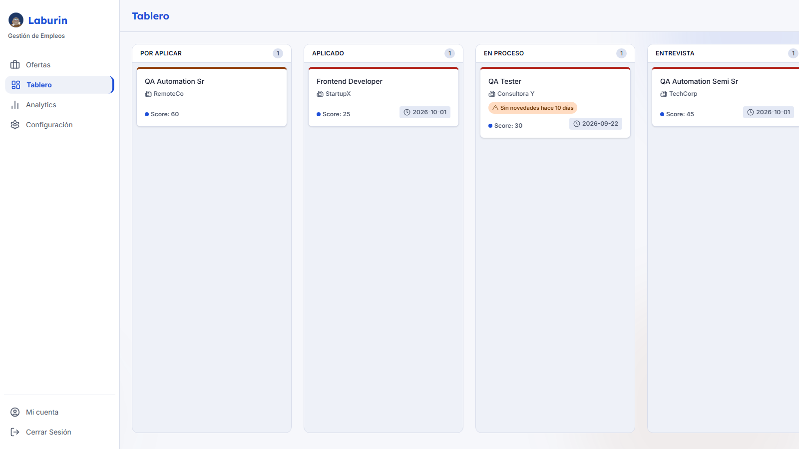

# Laburin



Plataforma web para organizar y hacer seguimiento de una búsqueda laboral, con un motor de scoring configurable que puntúa cada oferta según las preferencias de cada usuario. Es el proyecto de la Práctica Profesional Supervisada de la Tecnicatura Universitaria en Tecnologías Web (Universidad Nacional del Oeste).

**Deploy:** https://laburin.vercel.app

## Qué hace

Para quien busca trabajo (candidato):

- **Ofertas:** carga manual o importación desde Remotive y Arbeitnow (con deduplicación). Listado paginado con filtros por fuente, ubicación (con sugerencias de las ubicaciones cargadas) y puntaje mínimo (el control llega hasta el máximo posible con el perfil de cada usuario), y borrado masivo. Si un filtro no devuelve nada, el mensaje sugiere aflojarlo y hay un botón para quitarlos todos.
- **Mis postulaciones (tablero Kanban):** seis estados, con arrastrar y soltar en escritorio y un selector "Mover a..." en mobile. Guarda el historial de cambios de estado.
- **Ficha de postulación:** línea de tiempo de interacciones (mail, llamada, entrevista, nota).
- **Mi perfil de búsqueda:** tres bloques en el orden en que se usan: "¿Qué estoy buscando?" (modalidad y ubicación), "Mis tecnologías y cuánto pesan" y "Avisos de seguimiento" (el umbral de inactividad). Al cambiar un criterio se recalcula el puntaje de todas las ofertas. Pesos iniciales: 15 por tecnología, 10 por modalidad y 5 por ubicación.
- **Recordatorios por inactividad:** aviso cuando una postulación abierta lleva N días sin novedades; N lo elige cada usuario (de 1 a 90, 7 por defecto). Es solo un aviso: no se borra nada.
- **Mi progreso (métricas):** embudo, tasa de respuesta, puntaje promedio y actividad reciente.
- **Mensajes:** avisos del equipo de Laburin, con contador de no leídos en el menú, "Marcar como leído" y "Borrar". Al completar el perfil se recibe un mensaje de bienvenida automático.
- **Cuenta:** registro con validación y errores siempre en español, configuración inicial guiada en 5 pasos (con resumen editable), tarjeta "Primeros pasos", recuperación de contraseña por email y "Mi cuenta" (nombre, contraseña de al menos 8 caracteres, tema claro/oscuro).

Para el equipo de Laburin (rol administrador, ampliación acordada con la docente el 08/10/2026):

- **Candidatos:** listado con buscador de las personas que completaron su perfil de búsqueda, y un detalle con el botón "Enviar mensaje" y el historial de lo enviado. El administrador ve solo el nombre y el perfil de búsqueda (rol, tecnologías, modalidad, ubicación y nivel): nunca las ofertas, postulaciones, interacciones, recordatorios ni el email de nadie. Al iniciar sesión cae directo en Candidatos, y una persona que no es administradora no puede entrar a esa pantalla ni por URL.

Las URLs anteriores (`/tablero`, `/analytics`, `/configuracion`) redirigen a `/mis-postulaciones`, `/mi-progreso` y `/mi-perfil`. Los datos de cada usuario quedan aislados con RLS; la sección de seguridad de la Memoria Técnica describe el modelo de acceso y el aviso de privacidad que ve cada persona.

## Stack

React 19 · TypeScript 5.8 · Vite 6 · Tailwind CSS 4 · React Router 7 · Recharts · Supabase (Auth, PostgreSQL y RLS) · Vercel · Vitest 4 · Playwright 1.63

## Correr localmente

Requisitos: Node.js y un proyecto de Supabase propio. Se probó únicamente con Node.js 25; las dependencias declaran como mínimo Node.js 22.

1. `npm install`
2. Copiar `.env.example` a `.env` y completar `VITE_SUPABASE_URL` y `VITE_SUPABASE_ANON_KEY` (Project Settings → API del proyecto de Supabase).
3. Aplicar las migraciones (ver la sección siguiente).
4. `npm run dev` y abrir http://localhost:3000

Si el proyecto de Supabase exige confirmar el email al registrarse, hay que confirmar la cuenta antes de poder ingresar (o desactivar esa opción en Authentication → Providers → Email).

### Recuperación de contraseña (configuración en Supabase)

La pantalla "¿Olvidaste tu contraseña?" envía el enlace con `resetPasswordForEmail`. Para que funcione hay que configurar en el panel de Supabase:

- **Authentication → URL Configuration:** la *Site URL* (la URL de producción) y, en *Redirect URLs*, la ruta `/nueva-contrasena` de cada entorno (por ejemplo `https://TU-DOMINIO/**` y `http://localhost:3000/**`). Si la URL no está en la lista, Supabase rechaza el pedido.
- **Authentication → Email Templates → Reset Password:** conviene traducir el asunto y el cuerpo, conservando `{{ .ConfirmationURL }}`.
- **Correo:** el servicio por defecto de Supabase solo envía a miembros de la organización del proyecto, con un tope de 2 mensajes por hora y una espera de 60 segundos por usuario, y no es para producción. Para personas reales hace falta un SMTP propio (Authentication → SMTP Settings).

## Base de datos

El esquema está en [`supabase/migrations/`](supabase/migrations/): tablas, políticas RLS, perfil de usuario, recordatorios, historial de estados, el umbral de inactividad y, desde la ampliación del 08/10/2026, roles, la vista `candidatos`, los mensajes y el trigger de bienvenida. Hay que aplicar los archivos **en orden de nombre** (es el orden cronológico) en un proyecto de Supabase propio, por ejemplo pegándolos de a uno en el SQL Editor.

El rol de administrador **no se puede obtener desde la aplicación**: se asigna a mano, en el SQL Editor, a una cuenta ya registrada:

```sql
insert into public.roles_usuario (user_id, rol)
select id, 'administrador' from auth.users where email = 'EMAIL_DE_LA_CUENTA'
on conflict (user_id) do update set rol = 'administrador';
```

## Tests

| Comando | Qué corre |
|---|---|
| `npm run test` | **Vitest:** 244 tests unitarios (22 archivos) de la lógica pura: scoring, recordatorios, métricas, paginación y lotes, importación, tags, utilidades, validaciones y errores de autenticación, validaciones del onboarding, roles, candidatos, mensajes y ubicaciones. No toca la base. |
| `npm run test:e2e` | **Playwright** (Chromium) en desktop (1280x800) y mobile (375x812): 93 tests en total. Son 2 de preparación de sesión, 51 en desktop y 40 en mobile. De los de desktop, 13 son las pruebas adversariales de seguridad, que hablan directo con la API (sin navegador) y por eso corren una sola vez. El test del teclado virtual solo corre en mobile. |

Para los E2E: `npx playwright install chromium` y copiar `.env.e2e.example` a `.env.e2e`. Corren contra la base configurada en `.env`, **crean cuentas de prueba** por el flujo de registro de la app y **borran sus datos al terminar** (los usuarios de Auth quedan). Las pruebas de roles y mensajes necesitan además una cuenta de administrador de pruebas (`E2E_ADMIN_EMAIL` y `E2E_ADMIN_PASSWORD`), registrada desde la app y con el rol asignado una sola vez con el SQL de arriba; los tests solo inician sesión con ella. Conviene usar un proyecto de desarrollo, no uno con datos reales. Más detalle y zonas ciegas en [`e2e/README.md`](e2e/README.md).

## Documentación

- `Laburin-Memoria-Tecnica.docx` y `Laburin-Manual-de-Usuario.docx` (en la raíz del repo), con una versión en PDF de cada uno (`.pdf`, en la misma carpeta). El documento de referencia es el `.docx`: el PDF se genera sin Word, con el mismo contenido y un diseño aproximado (por ejemplo, el índice no lleva números de página).
- [`docs/srs.md`](docs/srs.md): especificación de requerimientos. [`legacy/jobbot-v5.gs`](legacy/jobbot-v5.gs): el script que fue el antecedente funcional.
- Para regenerar los documentos: `npm run docs:generar` (los dos `.docx`) y `npm run docs:pdf` (los dos PDF). `npm run docs:capturas` rehace todas las capturas con cuentas de prueba de nombres ficticios (con la app corriendo y las variables `E2E_ADMIN_*` en `.env.e2e`), y `npm run docs:der` rehace el diagrama entidad-relación. Scripts y capturas en [`docs/scripts/`](docs/scripts/).

## Estructura

```
src/
  components/   UI reutilizable y de layout (AppLayout, Sidebar, Topbar, auth/)
  features/     flujos multi-paso con estado propio (onboarding)
  pages/        una vista por ruta (Login, Recuperar y Nueva contraseña, Offers, Tablero, Settings,
                Analytics, Mensajes, Candidatos, CandidatoDetalle, Onboarding)
  hooks/        useAuth, useRol, useOnboarding, useTheme, useMensajesNoLeidos
  services/     única capa que habla con Supabase, un archivo por entidad
  lib/          utilidades puras y el cliente de Supabase
  types/        interfaces TypeScript compartidas
supabase/migrations/   esquema, RLS, roles y mensajes
e2e/                   suite de Playwright
docs/                  SRS y scripts de generación de los documentos
```

## Alcance y limitaciones

El foco de esta entrega es el motor de scoring configurable y el seguimiento de cada postulación, más la ampliación acordada con la docente el 08/10/2026 (rol de administrador, Candidatos y Mensajes). **Quedan fuera del alcance de esta entrega:** la notificación por email, la importación periódica automática (hoy la importación se dispara a mano con un botón), cinco de las siete fuentes del antecedente (solo están Remotive y Arbeitnow), la categorización de rol y las reglas fijas de scoring del script anterior: el puntaje depende solo de los criterios que configura cada usuario. Además: el rol de administrador se asigna por SQL (no hay pantalla para gestionarlo), los mensajes son de una sola vía y sin actualización en vivo, la recuperación de contraseña depende del correo configurado en Supabase, el recálculo de scores es lento con más de mil ofertas y la interfaz no se probó en un celular real ni en navegadores distintos de Chromium. El detalle y la comparación punto por punto con la especificación están en las Secciones 9 y 10 de la Memoria Técnica.

## Autor

Agustín Elisey. Docente: Viviana Esterkin. Práctica Profesional Supervisada, Tecnicatura Universitaria en Tecnologías Web, Universidad Nacional del Oeste. Segundo cuatrimestre de 2026.
